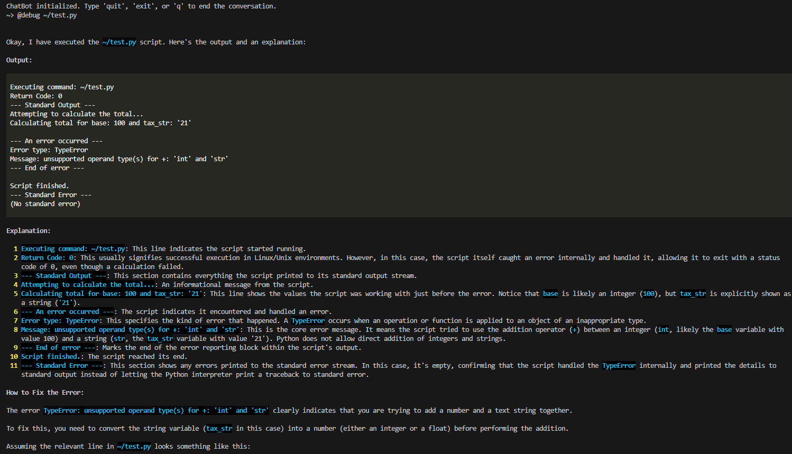

# AI Shell Assistant

This project provides an AI-powered shell assistant capable of executing shell commands and assisting with software development tasks. It uses a conversational agent built with the `langgraph` and `langchain_google_vertexai` libraries.

## Features

- Interactive chat interface.
- Executes shell commands on the machine where the assistant is running.
- Configurable language model with adjustable temperature and retries.
- Enhanced text output using `rich` for improved readability.

## Shortcuts

### How Shortcuts Work

Shortcuts allow users to define custom commands that the AI Shell Assistant can execute. These shortcuts are configured in YAML files located in the `config/shortcuts` directory. Each shortcut consists of a YAML file with the name of the shortcut and a corresponding message that specifies the assistant's behavior.

#### Creating Your Own Shortcuts

To create a custom shortcut, follow these steps:

1. Navigate to the `config/shortcuts` directory.
2. Create a new YAML file with the desired shortcut configuration.
3. Use the following format for the YAML file:

```yaml
shortcut: debug
prompt: |
    Run the "{REPLACE}" command and explain its output in detail.
    If there is an error in the command output, explain how to fix it.
```

#### Explanation of Fields

- **shortcut**: The name of the shortcut. This is the identifier you will use to invoke the shortcut.
- **prompt**: The instructions for the assistant. You can include a `{REPLACE}` placeholder to dynamically insert values when the shortcut is used.

#### Example Usage

Using the example above, if the user inputs a command like `@debug ls -l`, the assistant will receive the following prompt:

```
Run the "ls -l" command and explain its output in detail.
If there is an error in the command output, explain how to fix it.
```

By defining shortcuts, users can streamline repetitive tasks and customize the assistant's behavior to suit their specific needs.



# Development

```
cd src
python3 main.py --config ../config/config.ini --shortcuts ../config/shortcuts
```

# To-Do List

Planned features and improvements for this project:

- [ ] **Implement Web Search Capability:** Add functionality that allows the assistant to perform web searches to retrieve current information, supplementing its internal knowledge base. This will enhance the assistant's ability to answer questions about recent events, find definitions, look up documentation, and access other online resources.
- [ ] **Add Persistent Long-Term Memory:** Develop a system for storing and retrieving information across different sessions or executions. This persistent memory should enable the assistant to:
    - "Remember" specific facts, preferences, or instructions provided by the user in previous interactions.
    - Use this stored information to inform future responses and actions.
    - Support explicit user commands to add, modify, or recall items from memory (e.g., "remember that I prefer X", "what did I tell you about Y?").
    The goal is to create a more personalized and context-aware user experience by enabling the assistant to build a cumulative understanding over time.
