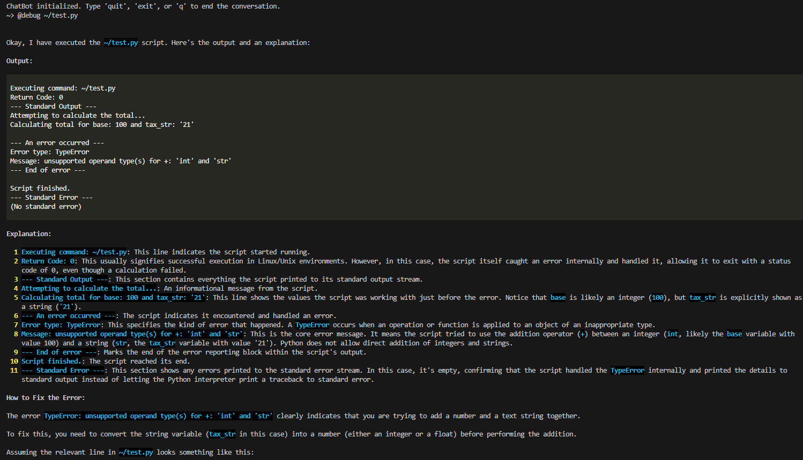

# AI Shell Assistant

This project provides an AI-powered shell assistant capable of executing shell commands and assisting with software development tasks. It uses a conversational agent built with the `langgraph` libraries.

## Features

- Interactive chat interface.
- Executes shell commands on the machine where the assistant is running.
- Configurable language model with adjustable temperature and retries.
- Enhanced text output using `rich` for improved readability.
- Web browsing capability to fetch and include online information in responses.

## Command Line Arguments

The assistant can be run with different arguments to customize its behavior:

- `--prompt`: Allows you to execute a direct query in non-interactive mode. The assistant will respond to the provided query and then exit.
    ```bash
    ai-shell-assistant --prompt "What is the purpose of the os.path.join function in Python?"
    ```

- `--file`: Loads the contents of a specific file into the agent's context. The assistant will take the contents of that file into account when responding.
    ```bash
    ai-shell-assistant --file ./src/main.py
    ```

- `--dir`: Recursively loads the contents of all files in a directory into the agent's context. Useful for queries about entire projects.
    ```bash
    ai-shell-assistant --dir ./src/
    ```

## Shortcuts

### How Shortcuts Work

Shortcuts allow users to define custom commands that the AI Shell Assistant can execute. These shortcuts are configured in YAML files located in the `config/shortcuts` directory. Each shortcut consists of a YAML file with the name of the shortcut and a corresponding message that specifies the assistant's behavior.

#### Creating Your Own Shortcuts

To create a custom shortcut, follow these steps:

1. Navigate to the `config/shortcuts` directory.
2. Create a new YAML file with the desired shortcut configuration.
3. Use the following format for the YAML file:

```yaml
shortcut: debug
prompt: |
    Run the "{REPLACE}" command and explain its output in detail.
    If there is an error in the command output, explain how to fix it.
```

#### Explanation of Fields

- **shortcut**: The name of the shortcut. This is the identifier you will use to invoke the shortcut.
- **prompt**: The instructions for the assistant. You can include a `{REPLACE}` placeholder to dynamically insert values when the shortcut is used.

#### Example Usage

Using the example above, if the user inputs a command like `@debug ls -l`, the assistant will receive the following prompt:

```
Run the "ls -l" command and explain its output in detail.
If there is an error in the command output, explain how to fix it.
```

By defining shortcuts, users can streamline repetitive tasks and customize the assistant's behavior to suit their specific needs.



# Install

👉 **Only models with tool-calling capabilities are supported by the assistant.** 👈

## Modes

### VertexAI

You **must** have [gcloud sdk](https://cloud.google.com/sdk/docs/install?hl=es-419) configured in your terminal and a project with access to the VertexAI API. Set the project name in the config/config.ini file.

### Ollama

[Ollama](https://ollama.com/) enables the use of local LLMs. 

## Development

```bash
git clone git@github.com:arrase/ai-shell-assistant.git
cd ai-shell-assistant
python3 -m venv .venv
source .venv/bin/activate
pip3 install -e .
ai-shell-assistant --config config/config.ini --shortcuts config/shortcuts
```

## Install as system command

```bash
git clone git@github.com:arrase/ai-shell-assistant.git
cd ai-shell-assistant
pip3 install .
cp -r config  ~/.config/ai-shell-assistant
ai-shell-assistant
```

## Build

```bash
git clone git@github.com:arrase/ai-shell-assistant.git
cd ai-shell-assistant
python3 -m venv .venv
source .venv/bin/activate
python setup.py sdist
```

## config.ini

```ini
[PREFERENCES]
mode = ollama # Values can be vertex or ollama
language = spanish
so = Linux # Tells the agent which operating system it is running on
logging_level = WARNING

[MODEL]
name = llama3.2:1b # Only tool-calling models are supported
temperature = 0.0
max_retries = 2

[VERTEX]
project = <YOUR VERTEX PROJECT HERE>
```

# To-Do List

Planned features and improvements for this project:

- [ ] **Add Persistent Long-Term Memory:** Develop a system for storing and retrieving information across different sessions or executions. This persistent memory should enable the assistant to:
    - "Remember" specific facts, preferences, or instructions provided by the user in previous interactions.
    - Use this stored information to inform future responses and actions.
    - Support explicit user commands to add, modify, or recall items from memory (e.g., "remember that I prefer X", "what did I tell you about Y?").
    The goal is to create a more personalized and context-aware user experience by enabling the assistant to build a cumulative understanding over time.
- [ ] **Vision capabilities**: Take a screenshot and add it to the query context
